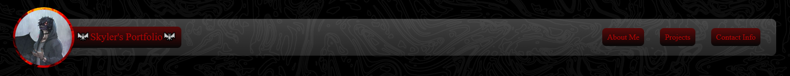
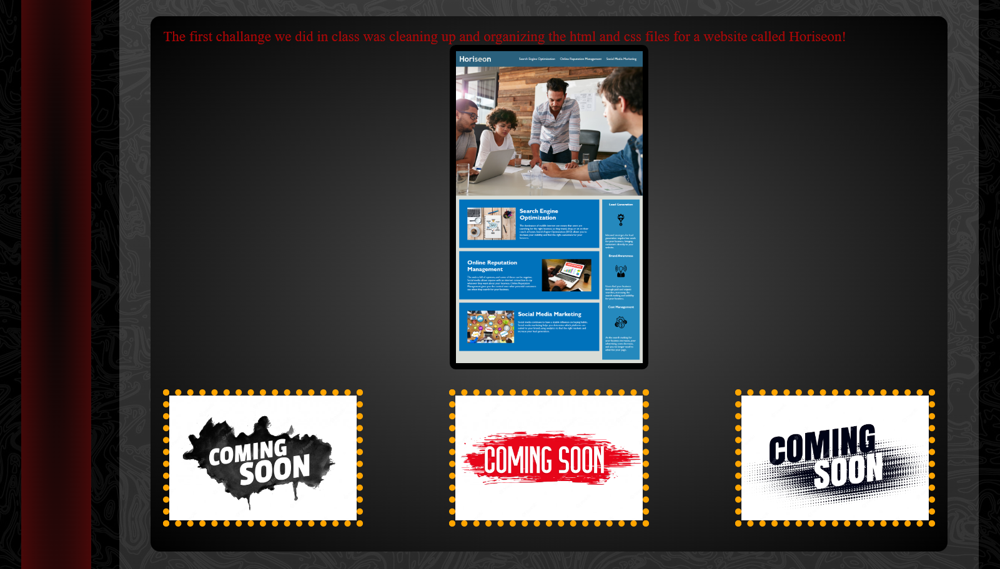

READ ME
Welcome to my portolio! (Link to portfolio: https://ricochet227.github.io/Portfolio/#aboutMe )

This is a portfolio that ill be using and updating and messing with overtime to showcase my abilities on what Ive learned in this bootcamp, Ive experimented with a lot already and put many many hours into making a webite I can feel proud of as of right now and this project can only go up from here!

To use:
On top youll notice the Navigation bar with my profile picture and 3 buttons

Buttons:
The three buttons are a quick and easy way to navigate around the webpage

Project links:
In order to get the links to my projects youll have to scroll to the project section and click on the thumbnail of the project you would like to veiw

Comming soon:
    I want to expand on the profile picture eventually, possibly pulling up a card with details/info or a whole resume

    More projects and hopefully some custom designed thumbnails to match the theme of the website and also the work done inside the project

    More exporation with CSS, specifically getting gifs to work would be awesome

    Possibly some JavaScript in the future

    THANK YOU FOR YOUR TIME! Have a great day :)